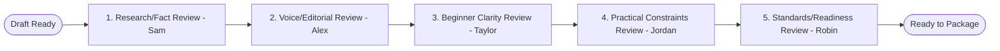

> Amended 2026-07-07 per Factory v2 Rulings Log (see /factory/station-map-v2.md).
> Ruling 4 applied: Alex reviews against the Casey Morse voice guide; Alex never writes.

# Editorial Review Standard v1

## Purpose

This document defines the official review passes, evaluation criteria, and escalation thresholds used in the Publishing Factory's quality-control pipeline.
**Note:** Reviewer responsibilities, review sequence, outcomes, escalation ownership, and reviewer boundaries are defined in `review-system-standard-v1.md`.

---

## The Five Review Passes

Every publication created in the Publishing Factory must undergo five distinct review passes. Each pass is owned by a specific role in the Publishing Room:

### 1. Research & Fact Review
*   **Owner:** Sam
*   **Focus:** Checks all external links, API costs, subscription terms, platform resource quotas, code snippets, and commands. Sam validates that all facts are documented and sourced directly from primary provider materials.

### 2. Editorial Voice Review
*   **Owner:** Alex
*   **Focus:** Reviews against the Casey Morse voice guide (`standards/casey-morse-voice-guide.md`). Evaluates narrative alignment, brand positioning, field-note voice, emotional tone, and narrative truthfulness. Alex ensures the voice matches the Casey Morse standard.
*   **Ruling 4 constraint:** Alex reviews only. Alex does not write, rewrite, or originate prose. Any passage that fails voice review is flagged for the human or returned as a REVISE with explicit instructions for the drafting agent.

### 3. Beginner Clarity Review
*   **Owner:** Taylor
*   **Focus:** Inspects explanations for clarity, identifies undefined industry terms or jargon, checks if prerequisites are missing, and ensures a newcomer can follow the guide without getting stuck.

### 4. Practical Constraints Review
*   **Owner:** Jordan
*   **Focus:** Verifies budget realism, validates risk warnings, evaluates cost containment advice, and flags elements that could lead to unexpected charges or high bills.

### 5. Publication Integrity Review
***NOTE: Reviewer roles, responsibilities, review sequence, outcomes, escalation ownership, and boundaries are defined in `review-system-standard-v1.md`.***

*   **Owner:** Robin
*   **Focus:** Checks layout structure, metadata completeness, format adherence (e.g., verifying a booklet is structured as a booklet), file conventions, and checks off all requirements in the final readiness checklist.

---

## Review Outcomes

For each of the five passes, the reviewing editor must issue one of the following determinations:

1.  **PASS**
    *   The document meets or exceeds all criteria for this pass. The file can proceed to the next review step.
2.  **REVISE**
    *   The document contains minor issues, structural gaps, or copy errors that must be resolved. The drafting agent receives instructions to revise the file and resubmit.
3.  **ESCALATE**
    *   The document contains critical blocker issues, factual ambiguity, or structural confusion that cannot be resolved through standard revision. The review process is halted, and the file is escalated to the human publisher.

---

## Escalation Criteria

A reviewer **must** issue an `ESCALATE` status and halt the production pipeline if any of the following conditions are met:

### Technical & Factual
*   **Uncertain Facts:** A claim, command, or workaround cannot be verified with 100% confidence.
*   **Stale Pricing/Limits:** Platform pricing structures, credits, or usage limits appear outdated or have changed since research.
*   **Unsupported Claims:** Content makes performance, reliability, or cost claims without citing primary source URLs or evidence.

### Financial Risk
*   **High-Risk Advice:** Recommendations could lead to a reader incurring avoidable fees, platform lock-in, or unchecked autoscale charges.

### Tone & Narrative
*   **Adversarial Tone:** The content attacks, insults, condescends to, or shames the reader for making builder mistakes.
*   **Fabricated Narratives:** Alex's narrative voice or case studies imply, fabricate, or invent false personal or professional lived experience.

### Format & Readiness
*   **Unclear Format:** The target publication format is ambiguous or the prompt did not specify the correct type.
*   **Confused Publication Type:** The file displays characteristics of multiple formats (e.g., a pamphlet is styled like a book, or a brief exceeds 3 pages).
*   **Unready for Release:** The content is useful and accurate but lacks mandatory visual layout, metadata, or standard components.
